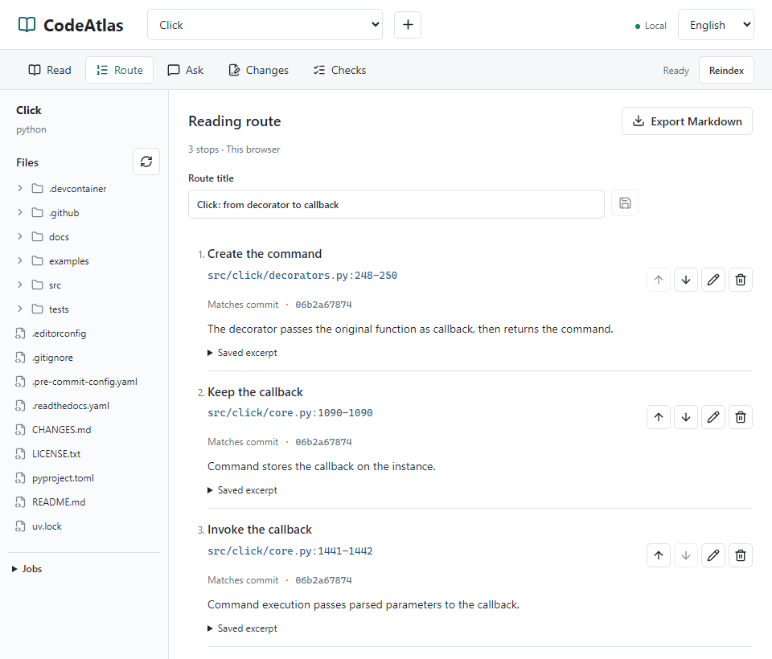

<h1 align="center">CodeAtlas</h1>

<p align="center"><strong>Read the code. Keep the trail.</strong></p>
<p align="center">Search source, check context, and turn code and notes into a shareable reading route.<br>Runs locally. No model key needed to read, annotate, or export.</p>

<p align="center">
  <a href="https://github.com/zlsjtj/CodeAtlas/actions/workflows/ci.yml"></a>
  <a href="LICENSE"></a>
</p>

<p align="center">
  <a href="#quick-start">Quick start</a> ·
  <a href="#reading-examples">Reading examples</a> ·
  <a href="docs/development.md">Docs</a> ·
  <a href="README.md">中文</a>
</p>

<picture>
  <source media="(max-width: 600px)" srcset="docs/assets/codeatlas-showcase-en-mobile.png">
  <source media="(prefers-reduced-motion: reduce)" srcset="docs/assets/codeatlas-showcase-en.png">
  
</picture>

<p align="center">The result, then the workflow. About 14 seconds of real actions, edited with some sections at 2× speed. No model calls.<br><a href="docs/assets/codeatlas-showcase-full-en.gif">Full 40-second recording</a> · <a href="docs/examples/click-showcase-route.en.md">Open the actual export</a> · <a href="docs/reading-example.en.md">Follow the walkthrough</a></p>

## Reading Examples

### Click: From Decorator to Callback

**How does `@command()` turn a function into a command?** Three stops in two files connect command creation, callback storage, and invocation.

[Follow the source](docs/reading-example.en.md) · [Read the actual export](docs/examples/click-showcase-route.en.md)

### CodeAtlas: Follow a Search Across the Stack

**How does a search travel from React to FastAPI and back?** Six stops in five files connect request handling, index lookup, ranking, and rendering.

[Follow the source](docs/codeatlas-search.en.md) · [Read the actual export](docs/examples/codeatlas-search-route.en.md)

Both notes were exported from the workspace. They keep source excerpts, annotations, and commit-pinned links, with timestamps and file hashes under “Source and version.” Read them on GitHub without installing anything, then use the same workflow for your own repository.

<details>
<summary><strong>See the three key lines from Click</strong></summary>

1. **Create the command** · [`decorators.py:248`](https://github.com/pallets/click/blob/06b2a678741131fd577ce170e23e5ca0aeba0309/src/click/decorators.py#L248)

   `cmd = cls(name=cmd_name, callback=f, params=params, **attrs)`

   The decorator passes the original function to the command as its callback.

2. **Keep the callback** · [`core.py:1090`](https://github.com/pallets/click/blob/06b2a678741131fd577ce170e23e5ca0aeba0309/src/click/core.py#L1090)

   `self.callback = callback`

   `Command` stores the callback on the instance for later execution.

3. **Invoke the callback** · [`core.py:1442`](https://github.com/pallets/click/blob/06b2a678741131fd577ce170e23e5ca0aeba0309/src/click/core.py#L1442)

   `return ctx.invoke(self.callback, **ctx.params)`

   Command execution passes the parsed parameters to that callback.

These are highlights from the notes. [Read the full excerpts and annotations](docs/examples/click-showcase-route.en.md)

</details>

## From Finding Code to Explaining It

Start with a question when joining a project, investigating an implementation, or writing a source-code walkthrough.

- **Find the implementation.** Import a local directory or public GitHub repository and search text or symbols. Open a result to explore highlighted source, line numbers, and surrounding context alongside the file tree.
- **Keep what you learn.** Save important line ranges, add notes, and arrange them in reading order. Reopen a stop when you come back to the code.
- **Share the whole route.** Export Markdown with source excerpts, notes, line ranges, and version provenance. Give the next reader a path through the code, not just a list of filenames.

Routes stay in the current browser and can be exported at any time. [Using reading routes](docs/reading-route.md#english)

## Quick Start

Try [v0.1.0-preview.4](https://github.com/zlsjtj/CodeAtlas/releases/tag/v0.1.0-preview.4). With **Python 3.11+, Node.js 20.12+, and Git** installed:

```sh
git clone --branch v0.1.0-preview.4 https://github.com/zlsjtj/CodeAtlas.git
cd CodeAtlas
npm run setup
npm run demo
```

Open the printed URL. **Click is already imported and indexed.** Search `callback=f` and open a result to follow the demo. The first run downloads a pinned Click revision. Demo data is separate; `.env` stays unchanged and its model key is not used. Press `Ctrl+C` to stop.

**Bring your own repository:** start with `npm run dev`, import it using the top `+` button, then build the index.

<details>
<summary><strong>Use Docker Compose</strong></summary>

After cloning this project, run from its root:

```sh
docker compose up --build --wait
```

Open [127.0.0.1:3000](http://127.0.0.1:3000) and import a public repository. Named volumes retain data after `docker compose down`. The preloaded Click example is provided by the native `npm run demo` command.

Local source requires an [explicit mount](docs/development.md#docker-挂载与端口). Ports bind only to loopback by default.

</details>

[Setup, ports, and data directories](docs/development.md) · [Releases](https://github.com/zlsjtj/CodeAtlas/releases)

## Add a Model When You Need One

Ask questions in the same workspace, inspect citations and tool-call records, then open the source to check the answer. For changes, review the draft and diff before confirming an apply and running repository checks.

Set `OPENAI_API_KEY` and `CODE_AGENT_OPENAI_MODEL` in the root `.env`; compatible services can also use `OPENAI_BASE_URL`. Start with `npm run dev`, or rerun Compose after changing configuration. [Model setup and validation notes](docs/development.md#model-and-execution-notes)

Model features send relevant source to the configured service and incur API costs. Keys stay on the backend.

## Development and Community

Next.js / TypeScript frontend, FastAPI / SQLite backend. CI covers native startup on Windows and Ubuntu, plus Docker builds and runtime checks on Linux.

[Development and tests](docs/development.md) · [Design notes](docs/design-notes.md) · [A reproduced and fixed maintenance case](docs/maintenance-reading.md) · [Report a problem or idea](https://github.com/zlsjtj/CodeAtlas/issues/new/choose)

Keep the service local; do not expose it to the public internet. Run checks only on trusted repositories. Remove private code and credentials before sharing exports or filing issues. [Execution notes](docs/development.md#model-and-execution-notes)

**Useful for the way you read code? Give CodeAtlas a Star, or share a repository and the route you took through it.**

[MIT License](LICENSE) · [Third-party notices](THIRD_PARTY_NOTICES.md)
