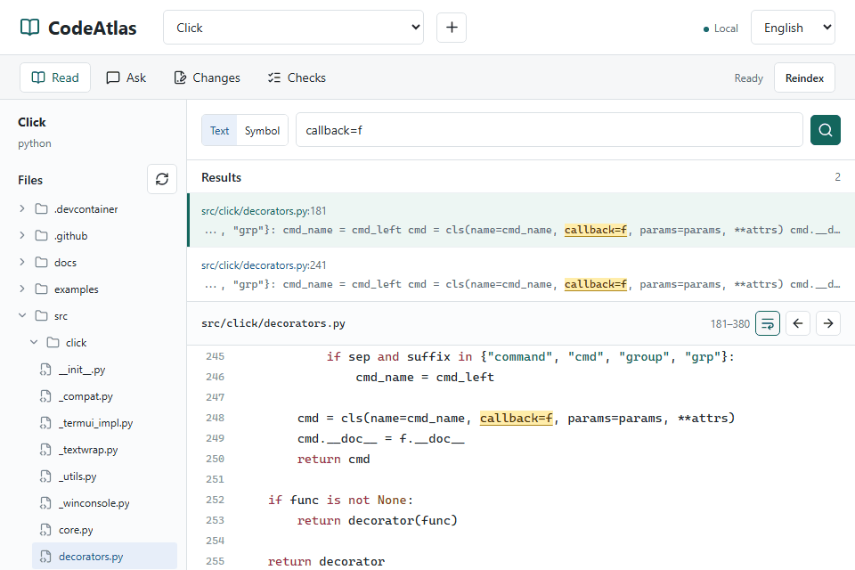

# CodeAtlas

Read unfamiliar codebases in a local workspace: search text or symbols, then follow the source with line numbers. No model key needed for code reading.

[](https://github.com/zlsjtj/CodeAtlas/actions/workflows/ci.yml) · [MIT](LICENSE)

[Quick start](#try-it-locally) · [Example](docs/reading-example.en.md) · [Preview](https://github.com/zlsjtj/CodeAtlas/releases/tag/v0.1.0-preview.2) · [中文](README.md)

## Follow One Question

**How does Click's `@command()` turn a function into an executable command?**

`Command` stores the decorated function as its callback, then runs it through `Context.invoke()`. The recording checks this path in the pinned source.

<picture>
  <source media="(max-width: 600px)" srcset="docs/assets/codeatlas-reading-en-mobile.png">
  <source media="(prefers-reduced-motion: reduce)" srcset="docs/assets/codeatlas-reading-en.png">
  
</picture>

About 28 seconds of actual use, at original speed with no model calls. Phones show a single-column still. [Full animation](docs/assets/codeatlas-reading-en.gif) · [Case and source checks](docs/reading-example.en.md)

In the pinned checkout:

1. Search `callback=f`: the decorator creates a command with the original function as its callback, [decorators.py:248](https://github.com/pallets/click/blob/06b2a678741131fd577ce170e23e5ca0aeba0309/src/click/decorators.py#L248).
2. Search `self.callback = callback`: `Command` stores that callback, [core.py:1090](https://github.com/pallets/click/blob/06b2a678741131fd577ce170e23e5ca0aeba0309/src/click/core.py#L1090).
3. Search `ctx.invoke(self.callback`: command execution passes the parsed parameters to the callback, [core.py:1442](https://github.com/pallets/click/blob/06b2a678741131fd577ce170e23e5ca0aeba0309/src/click/core.py#L1442).

This is a manual source-reading path, not an automatically generated call graph.

Keep these three locations and your notes as a [reading route](docs/reading-route.md#english), then [export Markdown](docs/examples/click-reading-route.en.md). This Click example is an actual workspace export, not a model answer. Routes stay in the current browser. This development feature is not included in `v0.1.0-preview.2`.

## Try It Locally

Install Python 3.11+, Node.js 20.12+, and Git, then:

```sh
git clone https://github.com/zlsjtj/CodeAtlas.git
cd CodeAtlas
npm run setup
npm run demo
```

Open the printed URL. Click is already imported and indexed: search `callback=f` in Text mode and open a result to follow the example. The first run downloads the pinned commit from GitHub.

Press `Ctrl+C` to stop. The example uses separate data, leaves `.env` unchanged, and does not use your model key.

For your own repositories, use `npm run dev`, import a local directory or public GitHub repository with the top `+` button, then index it. [Windows / Ubuntu setup, ports and data directories](docs/development.md)

### Docker Compose

With Docker and Compose installed, run from the project root:

```sh
docker compose up --build --wait
```

Open [127.0.0.1:3000](http://127.0.0.1:3000) and import a public repository. Docker does not preload the pinned example above; local source needs an [explicit mount](docs/development.md#docker-挂载与端口). Ports bind only to loopback, named volumes retain data, and `docker compose down` preserves them.

### Optional Q&A

Set `OPENAI_API_KEY` and `CODE_AGENT_OPENAI_MODEL` in the root `.env`; compatible services can also use `OPENAI_BASE_URL`. Start with `npm run dev`, or rerun Compose after changing configuration.

Q&A and drafts send relevant source to the model service and incur API costs. Keys stay on the backend. A configured key does not establish service availability. The six real-model cases have not been run; answer quality is not yet evaluated. [Validation status](docs/evidence/qa-status.json)

## Limits

- Retrieval uses keywords and line-based chunks; symbol matching uses regexes, not an AST or semantic index. Cross-file questions may miss evidence.
- Reads are limited to 200 lines. Tree, search, read and draft operations share exclusions for `.gitignore`, common credential paths and symlinks. Path filtering is not secret detection inside source files.
- Drafts are intended for small files. Applying checks the original file hash; apply-and-check rollback restores only the patched target files, not other effects of test scripts.
- pytest and npm scripts execute repository code. Run checks only on trusted repositories. There is no execution sandbox, authentication or multi-user isolation; do not expose the service publicly.

## Development and Feedback

FastAPI / SQLite backend, Next.js frontend.

[Development commands](docs/development.md) · [Design notes](docs/design-notes.md) · [Late-response maintenance case](docs/maintenance-reading.md)

[Report a problem](https://github.com/zlsjtj/CodeAtlas/issues/new/choose) with steps and a minimal public example; remove keys and private code. CodeAtlas is [MIT-licensed](LICENSE). Click source shown in the demo retains its [third-party license](THIRD_PARTY_NOTICES.md).
