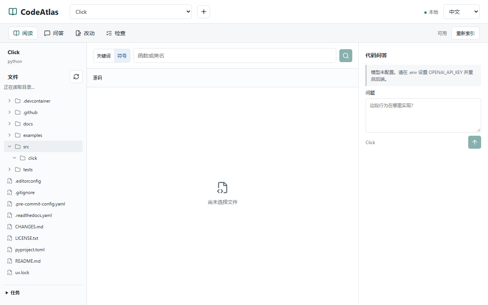

# CodeAtlas

Read an unfamiliar repository in your browser: find a symbol, open the source, and check the explanation.

[](https://github.com/zlsjtj/CodeAtlas/actions/workflows/ci.yml)
[MIT](LICENSE) · [中文](README.md) | English

CodeAtlas is a local code-reading workspace. Browse directories, search text or symbols, and read numbered source lines without a model key. With a model configured, ask questions and open the cited files. Patch drafts and checks remain available, with an explicit apply step after reviewing the diff.

## See It Work



A 26-second recording at original speed, using a pinned `pallets/click` checkout. No mocked responses or model calls. Real Q&A has not been accepted because no model key was configured. [Still image](docs/assets/codeatlas-reading.png) · [Pinned version and verification](docs/reading-example.md)

## Run

### Native

Install Python 3.11+, Node.js 20.12+, and Git, then:

```sh
git clone https://github.com/zlsjtj/CodeAtlas.git
cd CodeAtlas
npm run setup
npm run dev
```

The commands work in Windows PowerShell and Ubuntu. Setup creates `backend/.venv`, installs project dependencies, and creates `.env` only if missing. It does not replace existing settings or install system software.

Open the URL printed in the terminal, normally [127.0.0.1:3000](http://127.0.0.1:3000). Occupied ports are skipped, and the API URL and CORS origin follow the selected ports. `Ctrl+C` stops only the processes started by this launcher.

For a first try, import the absolute `frontend` path printed by the launcher, index it, and search for `WorkspaceShell` in Symbol mode. Click a result to open the definition. No key or API-docs detour is needed.

### Docker Compose

With Docker and Compose installed, run from the project root:

```sh
docker compose up --build --wait
```

Open [127.0.0.1:3000](http://127.0.0.1:3000). Ports bind only to loopback. Named volumes retain the index and cloned repositories. `docker compose down` stops the services; adding `--volumes` deletes their data.

Import a public GitHub repository in the UI, or explicitly mount a source directory using the [local mount instructions](docs/development.md). The containers do not mount your whole disk or the Docker socket. This is not a sandbox for executing untrusted code.

### Optional Q&A

Set `OPENAI_API_KEY` and `CODE_AGENT_OPENAI_MODEL` in the root `.env`; compatible services can also use `OPENAI_BASE_URL`. Restart native services, or run the Compose command again after changing settings.

The key is supplied only to the backend. Q&A and drafts send relevant code to the model service and incur API costs. The configuration indicator means a key is present, not that connectivity or model access has been verified.

## One Example

To find where Click defines `Command`, symbol search in the pinned checkout leads to [`src/click/core.py:985`](https://github.com/pallets/click/blob/06b2a678741131fd577ce170e23e5ca0aeba0309/src/click/core.py#L985). Opening it displays lines 985–1184, with paging for adjacent code.

This demonstrates source lookup, not model answer accuracy. Answer excerpts are separate from the current workspace file, which may have changed. Opening a referenced file does not establish that an answer is correct. Three questions for each of CodeAtlas and Click are pinned in the [case manifest](benchmarks/reading-cases.json); all six remain [unrun](docs/evidence/qa-status.json), not filled with test doubles.

## Limits and Development

- Retrieval uses keywords and line-based chunks; symbol matching uses regexes, not an AST or semantic index. Cross-file questions may miss evidence.
- Reads are limited to 200 lines. Tree, search, read and draft operations share exclusions for `.gitignore`, common credential paths and symlinks. Path filtering is not secret detection inside source files.
- Drafts are intended for small files. Applying checks the original file hash; apply-and-check rollback restores only the patched target files, not other effects of test scripts.
- pytest and npm scripts execute repository code. Run checks only on trusted repositories. There is no execution sandbox, authentication or multi-user isolation; do not expose the service publicly.

FastAPI / SQLite backend, Next.js frontend. CI runs Windows and Ubuntu native startup, backend regressions, frontend builds, Playwright, and a real Linux Docker smoke test. Model doubles are used only for tests, not as evidence of Q&A quality.

[Development commands](docs/development.md) · [Design notes](docs/design-notes.md) · [Late-response maintenance case](docs/maintenance-reading.md)

[Report a problem](https://github.com/zlsjtj/CodeAtlas/issues/new/choose) with steps and a minimal public example; remove keys and private code. CodeAtlas is [MIT-licensed](LICENSE). Click source shown in the demo retains its [third-party license](THIRD_PARTY_NOTICES.md).
