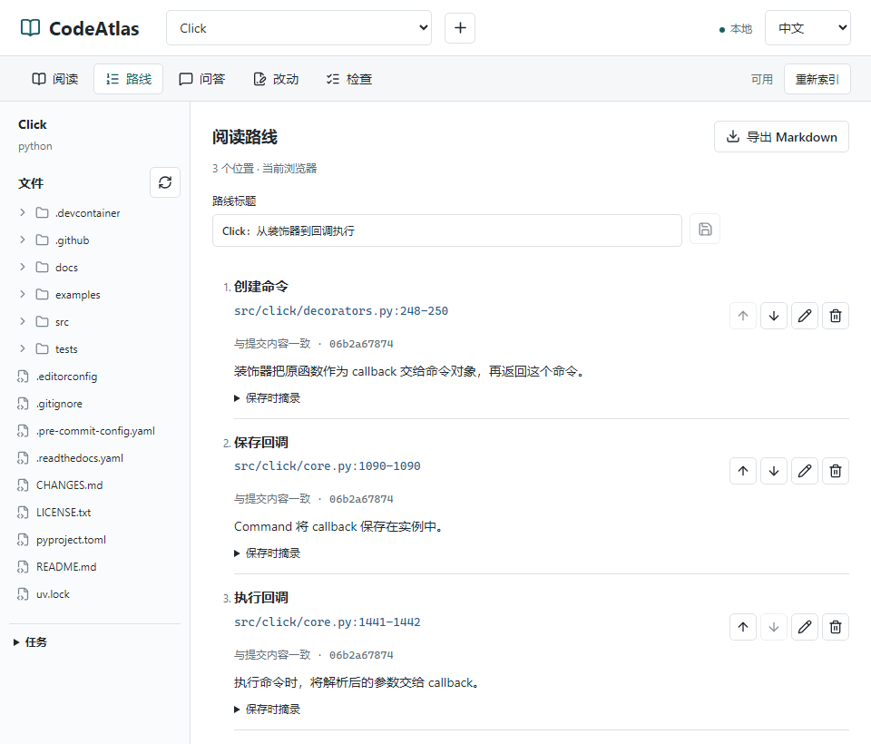

<h1 align="center">CodeAtlas</h1>

<p align="center"><strong>读懂陌生仓库，留下自己的源码阅读路线。</strong></p>
<p align="center">搜索实现、核对源码，把关键代码和笔记整理成可分享的 Markdown。<br>本地运行，阅读与整理无需模型 Key。</p>

<p align="center">
  <a href="https://github.com/zlsjtj/CodeAtlas/actions/workflows/ci.yml"></a>
  <a href="LICENSE"></a>
</p>

<p align="center">
  <a href="#快速开始">快速开始</a> ·
  <a href="#看看能读懂什么">阅读案例</a> ·
  <a href="docs/development.md">文档</a> ·
  <a href="README.en.md">English</a>
</p>

<picture>
  <source media="(max-width: 600px)" srcset="docs/assets/codeatlas-showcase-mobile.png">
  <source media="(prefers-reduced-motion: reduce)" srcset="docs/assets/codeatlas-showcase.png">
  
</picture>

<p align="center">先看成果，再看怎么做。约 14 秒真实操作剪辑，部分 2 倍速，无模型调用。<br><a href="docs/assets/codeatlas-showcase-full.gif">40 秒完整实录</a> · <a href="docs/examples/click-showcase-route.md">打开本次导出的笔记</a> · <a href="docs/reading-example.md">跟着案例读一遍</a></p>

## 看看能读懂什么

### Click：从装饰器到回调执行

**`@command()` 怎样把普通函数变成命令？** 两个文件、三个阅读位置，串起命令创建、回调保存和最终调用。

[跟着源码读一遍](docs/reading-example.md) · [打开实际导出的笔记](docs/examples/click-showcase-route.md)

### CodeAtlas：一次搜索怎样穿过前后端

**搜索怎样从 React 走到 FastAPI，再返回结果？** 五个源码文件、六个阅读位置，串起请求发送、索引查询、排序和界面展示。

[跟着源码读一遍](docs/codeatlas-search.md) · [打开实际导出的笔记](docs/examples/codeatlas-search-route.md)

两份笔记均由工作台实际导出，保留源码摘录、笔记和固定提交链接，保存时间与文件哈希收在“来源与版本”中。无需安装就能在 GitHub 上阅读，也可以用同样的方式整理自己的仓库。

<details>
<summary><strong>展开 Click 的三处关键源码</strong></summary>

1. **创建命令** · [`decorators.py:248`](https://github.com/pallets/click/blob/06b2a678741131fd577ce170e23e5ca0aeba0309/src/click/decorators.py#L248)

   `cmd = cls(name=cmd_name, callback=f, params=params, **attrs)`

   装饰器把原函数作为 callback 交给命令对象。

2. **保存回调** · [`core.py:1090`](https://github.com/pallets/click/blob/06b2a678741131fd577ce170e23e5ca0aeba0309/src/click/core.py#L1090)

   `self.callback = callback`

   `Command` 把 callback 保存到实例，供执行时使用。

3. **执行回调** · [`core.py:1442`](https://github.com/pallets/click/blob/06b2a678741131fd577ce170e23e5ca0aeba0309/src/click/core.py#L1442)

   `return ctx.invoke(self.callback, **ctx.params)`

   执行命令时，把解析后的参数交给 callback。

这里是笔记节选。[查看完整摘录与笔记](docs/examples/click-showcase-route.md)

</details>

## 从找到代码，到讲清代码

接手一个项目、追查某个功能的实现，或准备一篇源码笔记，都可以从一个具体问题开始。

- **找到实现。** 导入本地目录或公开 GitHub 仓库，搜索关键词或符号；点击结果，在目录和带行号的源码之间切换，查看高亮与上下文。
- **留下理解。** 保存关键代码的行范围，写下笔记，按阅读顺序排列。下次打开路线，可以回到对应位置继续读。
- **分享一条完整路线。** 导出 Markdown，保留源码摘录、笔记、行号和版本来源。把散落在文件里的线索，整理成别人能跟着看的阅读记录。

路线保存在当前浏览器，可随时导出。[查看路线操作](docs/reading-route.md)

## 快速开始

试用版本：[v0.1.0-preview.4](https://github.com/zlsjtj/CodeAtlas/releases/tag/v0.1.0-preview.4)。准备 **Python 3.11+、Node.js 20.12+ 和 Git**，然后运行：

```sh
git clone --branch v0.1.0-preview.4 https://github.com/zlsjtj/CodeAtlas.git
cd CodeAtlas
npm run setup
npm run demo
```

打开终端打印的地址，**Click 已经导入并建立索引**。搜索 `callback=f`，点击结果，就能开始上面的阅读过程。首次运行会下载固定版本的 Click；示例数据独立保存，不覆盖 `.env`，也不使用其中的模型 Key。退出按 `Ctrl+C`。

**读自己的仓库：** 用 `npm run dev` 启动，点击顶部 `+` 导入仓库，再建立索引。

<details>
<summary><strong>使用 Docker Compose</strong></summary>

克隆本项目后，在项目根目录运行：

```sh
docker compose up --build --wait
```

打开 [127.0.0.1:3000](http://127.0.0.1:3000)，在界面导入公开仓库。Compose 使用命名卷保存数据，`docker compose down` 后仍然保留；固定 Click 示例由原生 `npm run demo` 提供。

宿主源码通过[显式挂载](docs/development.md#docker-挂载与端口)导入。端口默认只向本机开放。

</details>

[启动、端口与数据目录](docs/development.md) · [版本记录](https://github.com/zlsjtj/CodeAtlas/releases)

试过之后，[说说你想读懂什么、实际做到哪一步](https://github.com/zlsjtj/CodeAtlas/issues/new?template=trial-feedback.yml)。只看了案例或没跑通，也可以反馈。

## 需要时，接上模型一起读

在同一工作台中提问，查看回答引用与工具调用记录，再回到源码核对。需要改动时，先查看草案和 diff，确认后应用，并运行仓库检查。

在根目录 `.env` 设置 `OPENAI_API_KEY`、`CODE_AGENT_OPENAI_MODEL`；兼容服务另设 `OPENAI_BASE_URL`。用 `npm run dev` 启动，或修改配置后重新执行 Compose 命令。[配置与模型验证说明](docs/development.md#模型与运行说明)

模型功能会将相关源码发送到所配置的服务，并产生 API 费用；Key 仅供后端使用。

## 开发与交流

Next.js / TypeScript 前端，FastAPI / SQLite 后端。CI 覆盖 Windows、Ubuntu 原生启动，以及 Linux Docker 构建与运行。

[开发与测试](docs/development.md) · [设计记录](docs/design-notes.md) · [一次维护的复现与修复](docs/maintenance-reading.md) · [提交问题或建议](https://github.com/zlsjtj/CodeAtlas/issues/new/choose)

本项目面向本机使用，请勿直接暴露到公网；只对信任的仓库运行检查。导出笔记或提交 Issue 前，请移除私有代码和凭据。[运行说明](docs/development.md#模型与运行说明)

**觉得这套阅读方式有用，欢迎 Star 收藏，也欢迎分享你读过的仓库和阅读路线。**

[MIT License](LICENSE) · [第三方许可](THIRD_PARTY_NOTICES.md)
