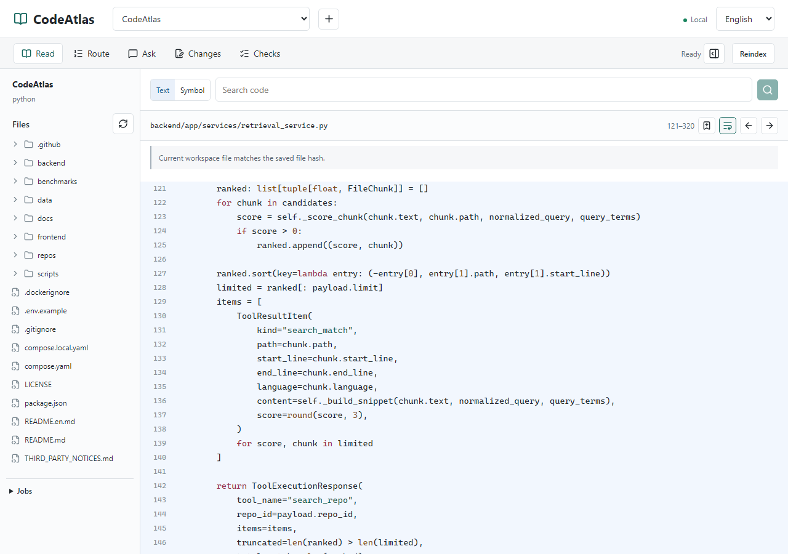

# Read CodeAtlas's Own Search Flow

**What happens between pressing Enter and seeing search results?** Follow CodeAtlas across TypeScript and Python, then keep the explanation as a six-stop reading route.

[Open the actual Markdown export](examples/codeatlas-search-route.en.md) · [中文](codeatlas-search.md)

## The Whole Path

`Search form → React hook → HTTP client → FastAPI route → Index query → Result list`

The frontend manages requests and rendering; the backend queries and ranks indexed code chunks in SQLite. Opening a result sends a separate request to read the current workspace file.

All source links are pinned to [`0309bce`](https://github.com/zlsjtj/CodeAtlas/tree/0309bce354bd666586e52988ebaf9522f5ddb210), so later changes to master do not move the reference code.

1. **[Prepare the search](examples/codeatlas-search-route.en.md#1-prepare-the-search)**: Where do the repository ID, query, and limit come from? What happens to an earlier request? Search `async function search(query:`.
2. **[Send the HTTP request](examples/codeatlas-search-route.en.md#2-send-the-http-request)**: Which endpoint receives the payload? Search `export function repositoryTool(`.
3. **[Receive the search request](examples/codeatlas-search-route.en.md#3-receive-the-search-request)**: How does Python receive it and get a database session? Search `@router.post("/search"`.
4. **[Select indexed candidates](examples/codeatlas-search-route.en.md#4-select-indexed-candidates)**: Does search read files or the existing index? Search `statement = select(FileChunk)`.
5. **[Rank and shape the results](examples/codeatlas-search-route.en.md#5-rank-and-shape-the-results)**: How are matches ranked, and what fields come back? Search `ranked.sort`.
6. **[Render results and open source](examples/codeatlas-search-route.en.md#6-render-results-and-open-source)**: How does a click locate the source file? Search `reader.results.map`.

## Connect the Files

Form submission calls [`reader.search(query, mode)`](https://github.com/zlsjtj/CodeAtlas/blob/0309bce354bd666586e52988ebaf9522f5ddb210/frontend/components/reader/repository-reader.tsx#L62). The hook clears old results before sending the request. [`begin`](https://github.com/zlsjtj/CodeAtlas/blob/0309bce354bd666586e52988ebaf9522f5ddb210/frontend/lib/hooks/use-repository-reader.ts#L27-L33) aborts the previous request on the same channel, and the response is checked for cancellation before updating results.

`repositoryTool("search", ...)` selects `/api/tools/search`. The shared [`request`](https://github.com/zlsjtj/CodeAtlas/blob/0309bce354bd666586e52988ebaf9522f5ddb210/frontend/lib/api.ts#L51-L76) adds the backend URL, headers, and error handling. The FastAPI route receives the structured payload and delegates through [`RepositoryTools.search_repo`](https://github.com/zlsjtj/CodeAtlas/blob/0309bce354bd666586e52988ebaf9522f5ddb210/backend/app/tools/repository_tools.py#L20-L21) to the query service.

The query is scoped to the repository and adds a condition for each term. After file-policy filtering, it collects at most `min(limit * 8, 200)` candidates. Those candidates are scored and sorted, then returned with paths, line ranges, and snippets. This is a walkthrough of text search, not an automatically generated call graph.

<picture>
  <source media="(max-width: 600px)" srcset="assets/codeatlas-search-en-mobile.png">
  
</picture>

*The real workspace, with “Rank and shape the results” reopened and its saved line range highlighted.*

## A Match Is Not a Fresh File Read

Clicking a result calls [`openSource`](https://github.com/zlsjtj/CodeAtlas/blob/0309bce354bd666586e52988ebaf9522f5ddb210/frontend/lib/hooks/use-repository-reader.ts#L94-L119), which requests up to 200 lines of current source from `/api/tools/read`. The indexed snippet and the opened file were obtained at different times. Reindex after source changes to update search results.

A reading route keeps the selected excerpt and file hash from the time it was saved. Reopening a stop checks whether the current file still matches. The route therefore keeps the source behind the explanation, not just filenames to revisit.

## Follow It Yourself

1. Run `npm run setup` and `npm run demo` as shown in the README.
2. Import a local CodeAtlas checkout using the top `+` button and index it. The line ranges and export links here refer to `0309bce`; check current source when reading another revision.
3. Search the terms above, open the matching files, and save the ranges shown in the export with titles and notes.
4. Arrange the stops in Route and export Markdown.

The linked Markdown was downloaded directly from the workspace, without manual rewriting. The six stops and explanations were defined in a [case manifest](examples/codeatlas-search-case.json), not inferred automatically by the app. Chinese and English runs separately checked source text, excerpts, hashes, persistence after reload, and reopening. Neither run made model calls.

[Chinese capture record](evidence/codeatlas-search.json) · [English capture record](evidence/codeatlas-search-en.json) · [Reproduce the capture](development.md#跨前后端阅读案例)
