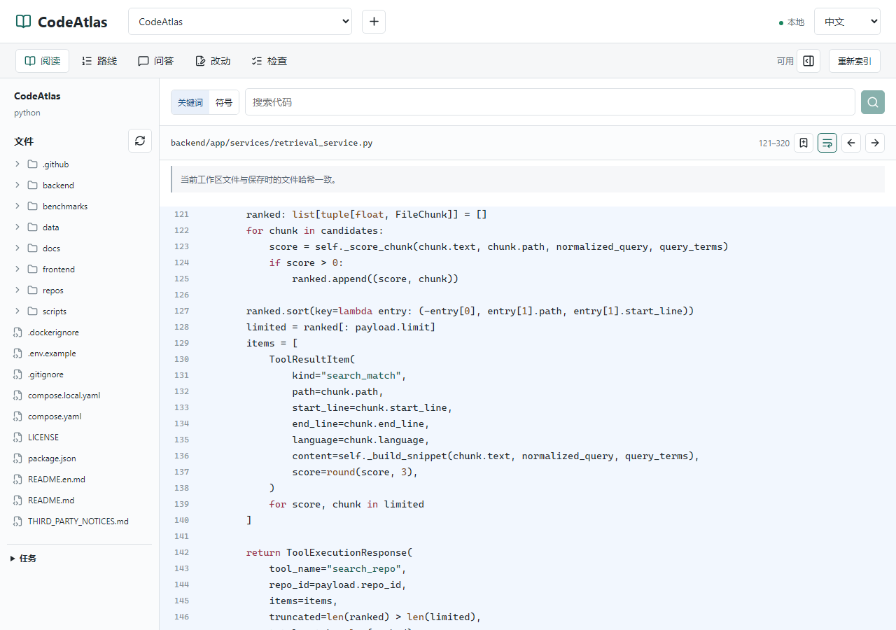

# 用 CodeAtlas 读懂它自己的搜索

**在搜索框按下回车，结果是怎样从后端回到界面的？** 这次读 CodeAtlas 自己：跨过 TypeScript 和 Python，把一次关键词搜索整理成六个位置的阅读路线。

[直接看工作台导出的笔记](examples/codeatlas-search-route.md) · [English](codeatlas-search.en.md)

## 先看整条路径

`搜索表单 → React hook → HTTP 客户端 → FastAPI 路由 → 索引查询 → 结果列表`

前端负责请求状态和展示，后端负责查询与排序。搜索用的是 SQLite 中已建立的代码片段索引；点开结果后，另一次读取请求才去打开当前工作区文件。

下面的源码固定在 [`0309bce`](https://github.com/zlsjtj/CodeAtlas/tree/0309bce354bd666586e52988ebaf9522f5ddb210)，不会随 master 的后续改动漂移。

1. **[发起搜索](examples/codeatlas-search-route.md#1-发起搜索)**：仓库 ID、关键词和数量上限从哪里来？怎样处理前一次请求？搜索 `async function search(query:`。
2. **[发出 HTTP 请求](examples/codeatlas-search-route.md#2-发出-http-请求)**：请求发到哪个接口，载荷怎样传递？搜索 `export function repositoryTool(`。
3. **[接收搜索请求](examples/codeatlas-search-route.md#3-接收搜索请求)**：请求如何进入 Python，数据库会话由谁提供？搜索 `@router.post("/search"`。
4. **[查询索引片段](examples/codeatlas-search-route.md#4-查询索引片段)**：搜索读的是文件，还是已经建立的索引？搜索 `statement = select(FileChunk)`。
5. **[排序并返回结果](examples/codeatlas-search-route.md#5-排序并返回结果)**：结果怎么排序，返回哪些字段？搜索 `ranked.sort`。
6. **[展示结果并打开源码](examples/codeatlas-search-route.md#6-展示结果并打开源码)**：点击列表后，界面怎样找到对应文件？搜索 `reader.results.map`。

## 把文件之间的关系接起来

表单提交调用 [`reader.search(query, mode)`](https://github.com/zlsjtj/CodeAtlas/blob/0309bce354bd666586e52988ebaf9522f5ddb210/frontend/components/reader/repository-reader.tsx#L62)。hook 先清空旧结果，再发起请求；[`begin`](https://github.com/zlsjtj/CodeAtlas/blob/0309bce354bd666586e52988ebaf9522f5ddb210/frontend/lib/hooks/use-repository-reader.ts#L27-L33) 会取消同一通道的前一次请求。响应回来时仍会检查取消状态，避免旧结果覆盖新的搜索。

`repositoryTool("search", ...)` 选择 `/api/tools/search`；共享的 [`request`](https://github.com/zlsjtj/CodeAtlas/blob/0309bce354bd666586e52988ebaf9522f5ddb210/frontend/lib/api.ts#L51-L76) 加上后端地址、请求头和错误处理。FastAPI 路由收到结构化载荷后，经 [`RepositoryTools.search_repo`](https://github.com/zlsjtj/CodeAtlas/blob/0309bce354bd666586e52988ebaf9522f5ddb210/backend/app/tools/repository_tools.py#L20-L21) 转交查询服务。

查询先限定仓库，再逐个添加关键词条件。经过文件规则过滤后，最多收集 `min(limit × 8, 200)` 个候选片段，对这些候选评分、排序，返回路径、行范围和摘要。这里追踪的是关键词搜索，不是自动生成的调用图。

<picture>
  <source media="(max-width: 600px)" srcset="assets/codeatlas-search-mobile.png">
  
</picture>

*真实工作台：从路线重新打开“排序并返回结果”，高亮保存的行范围。*

## 搜索到了，不等于文件没变

点击结果时，[`openSource`](https://github.com/zlsjtj/CodeAtlas/blob/0309bce354bd666586e52988ebaf9522f5ddb210/frontend/lib/hooks/use-repository-reader.ts#L94-L119) 会再请求 `/api/tools/read`，每次最多读取 200 行当前源码。这与结果列表中的索引摘要是两份不同时间取得的内容。修改源码后，需要重新索引才能更新搜索结果。

阅读路线保存的是当时选中的摘录和文件哈希。重新打开位置时，界面核对当前文件是否仍与保存版本一致。因此，这条路线既能解释一次请求，也留下了可核对的源码依据。

## 自己走一遍

1. 按首页运行 `npm run setup`、`npm run demo`。
2. 用顶部 `+` 导入一个本地 CodeAtlas checkout，并建立索引。案例的行号和导出链接对应固定提交 `0309bce`；读其他版本时以当前源码为准。
3. 依次搜索这六个关键词，打开对应文件，在导出笔记标明的范围保存标题和笔记。
4. 在“路线”中调整顺序，导出 Markdown。

本页链接的 Markdown 是工作台直接下载的文件，未手工改写；六个位置和解读预先写在[案例清单](examples/codeatlas-search-case.json)中，不是应用自动推导出的调用链。中英文分别通过真实界面完成，核对了源码、摘录、哈希、刷新恢复和再次打开，模型请求数均为 0。

[中文核对记录](evidence/codeatlas-search.json) · [英文核对记录](evidence/codeatlas-search-en.json) · [自动复现命令](development.md#跨前后端阅读案例)
