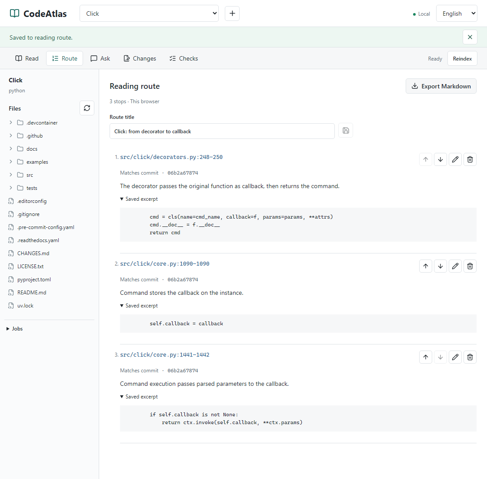

# Following a Click Callback

How does `@click.command()` turn an ordinary function into a command? This example follows three searches across two files, without a model.

## Reproduce It

Run `npm run setup`, then `npm run demo`. Open the printed URL and select English in the workspace. The demo imports and indexes Click at commit [`06b2a678741131fd577ce170e23e5ca0aeba0309`](https://github.com/pallets/click/tree/06b2a678741131fd577ce170e23e5ca0aeba0309).

1. Search `callback=f`. At [`decorators.py:248`](https://github.com/pallets/click/blob/06b2a678741131fd577ce170e23e5ca0aeba0309/src/click/decorators.py#L248), the decorator passes the original function to the command constructor.
2. Search `self.callback = callback`. At [`core.py:1090`](https://github.com/pallets/click/blob/06b2a678741131fd577ce170e23e5ca0aeba0309/src/click/core.py#L1090), `Command` stores the callback. Check the enclosing class: the search also returns other matches.
3. Search `ctx.invoke(self.callback`. At [`core.py:1442`](https://github.com/pallets/click/blob/06b2a678741131fd577ce170e23e5ca0aeba0309/src/click/core.py#L1442), command execution passes parsed parameters to that callback.

These locations explain how the function is stored and invoked. They do not cover all parameter parsing, exception handling or command-group behavior. The tool searches text; it does not infer the call graph.

## Recording

The [English recording](assets/codeatlas-reading-en.gif) uses the actual workspace on Windows and Chromium, at 960 by 640 pixels. The first frame keeps the `callback=f` query, selected result and highlighted decorator source visible; installation and downloading are not included. The interface is switched to English before capture; labels are not painted onto an earlier recording.

The approximately 28-second sequence uses captured browser frames at original speed, without cuts or model responses. The recorder compares every displayed source line with the pinned checkout, checks the 200-line read limit, and records file hashes and line ranges in the [capture receipt](evidence/reading-demo-en.json). The [mobile still](assets/codeatlas-reading-en-mobile.png) shows the reader panel at a 390-pixel viewport with line wrapping enabled.

Both language versions show the same Click source, covered by its [BSD-3-Clause notice](../THIRD_PARTY_NOTICES.md). Neither is an endorsement by Pallets.

During capture, a 200-line read starting inside a docstring caused misleading colors on later code. Non-initial pages now highlight each line independently. Multiline colors can be incomplete in these fragments; colors do not establish syntax correctness. A regression test covers the truncated-docstring case, alongside the recorder's text comparisons.

## Keep the Reading Route

Save these locations with notes: `decorators.py:248-250`, `core.py:1090`, and `core.py:1441-1442`. Open Route to review their order and export Markdown.

<picture>
  <source media="(max-width: 600px)" srcset="assets/codeatlas-route-en-mobile.png">
  
</picture>

[Actual Markdown export](examples/click-reading-route.en.md) · [Source and screenshot checks](evidence/reading-route-en.json)

The file is the workspace's unedited export. The three notes are annotations from reading the source, not model answers. Excerpts were compared with the pinned checkout; whole-file hashes and commit-link construction were checked locally. Screenshots use the English interface on Windows Chromium, at 1120 by 1100 and 390 by 844 pixels. Remote link availability was not checked, and the tool did not infer the call graph.

Routes stay in the current browser. Opening a stop reads the current workspace; it does not update the saved excerpt. See [storage and version boundaries](reading-route.md#english) and the Click excerpts' [BSD-3-Clause notice](../THIRD_PARTY_NOTICES.md). This feature is available from `v0.1.0-preview.3`.

To reproduce, leave `npm run demo` running and execute `node frontend/scripts/capture-reading-route.mjs --locale en` in another terminal. It uses an isolated browser, without reading an existing profile. A successful run updates the example, screenshots and receipt; failed attempts remain in `data/reading-route-capture/`. Set `DEMO_WEB_URL` and `DEMO_API_URL` for custom ports. The Chinese capture uses the default locale in a separate run.

## What This Does Not Validate

No model requests were made. The six predeclared Q&A cases remain [`not_run`](evidence/qa-status.json); there are no real-model answer-quality or citation-quality results. Browser-test substitutes are not used in the recording.
