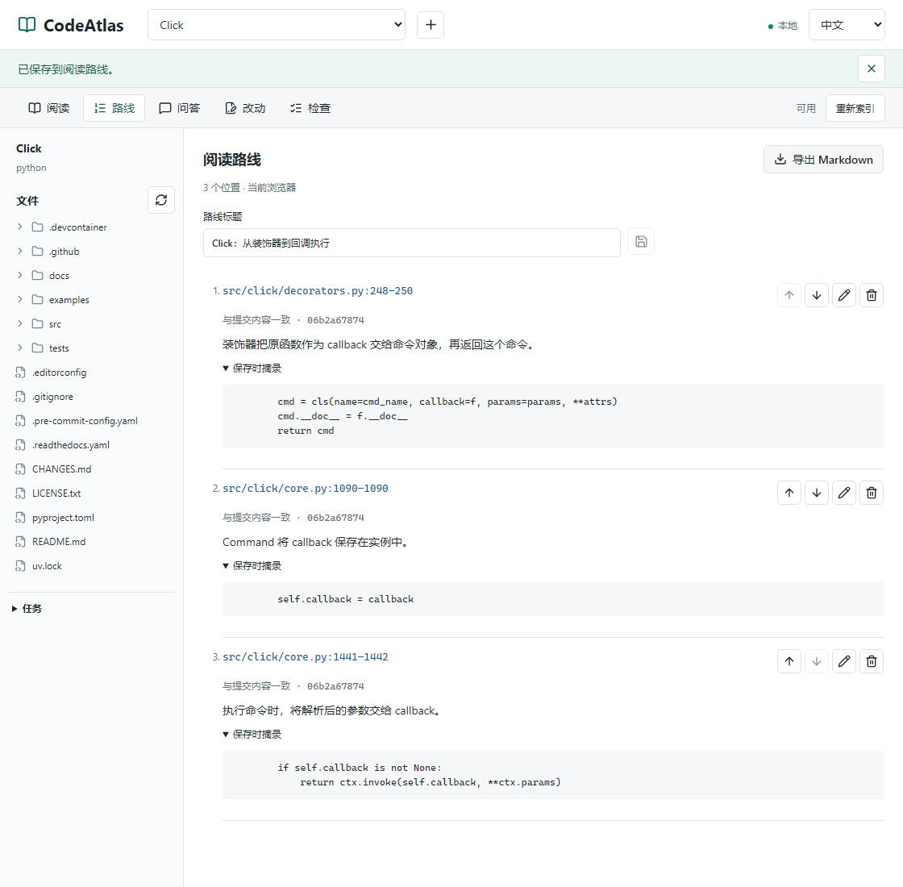

# 从 Click 装饰器读到回调执行

问题是：`@click.command()` 怎样把一个普通函数变成命令？这次不用模型，沿着搜索结果阅读两个文件。

## 固定输入

- CodeAtlas 阅读界面：问答栏收起，源码自动换行，显示语法颜色、搜索命中和当前结果。
- Click：[`06b2a678741131fd577ce170e23e5ca0aeba0309`](https://github.com/pallets/click/tree/06b2a678741131fd577ce170e23e5ca0aeba0309)。
- Windows，Chromium，桌面 960 × 640，手机 390 × 720；界面语言中文。使用 `npm run demo`，未调用模型。

## 操作与结果

1. `npm run demo` 准备固定提交、导入并索引 Click。打开打印的地址，展开 `src/click`。
2. 关键词搜索 `callback=f`。在 `decorators.py:248`，`cls(...)` 以原函数 `f` 作为 callback 创建命令，再返回命令对象。
3. 搜索 `self.callback = callback`。在 `core.py:1090`，`Command` 将 callback 保存到实例。这里也有其他匹配，注意核对类和文件上下文。
4. 搜索 `ctx.invoke(self.callback`。在 `core.py:1442`，命令执行时用解析后的 `ctx.params` 调用 callback。

这三处代码解释的是“原函数如何被保存并最终调用”，不覆盖完整参数解析、异常处理或命令组流程。工具提供关键词匹配和源码，没有自动分析调用关系。

录制脚本将每次打开的源码与固定 checkout 逐行比较，检查单次不超过 200 行，再记录文件哈希及行范围。[GIF](assets/codeatlas-reading.gif) 是约 28 秒的原速截图序列，没有加速、剪辑或模型响应。首帧保留 `callback=f` 查询、选中的结果和装饰器源码，不包含安装和下载。

[桌面静态画面](assets/codeatlas-reading.png)、[手机阅读栏截图](assets/codeatlas-reading-mobile.png)与[机器可读记录](evidence/reading-demo.json)一并保留。手机图来自实际窄屏布局，不是缩小的桌面图；首页对手机和减少动态效果偏好使用静态图。Click 源码使用 BSD-3-Clause，见[许可说明](../THIRD_PARTY_NOTICES.md)。

[英文案例](reading-example.en.md)沿用同一固定提交和三次搜索，在工作台切换到 English 后独立录制，素材及核对记录分别保留。

## 保存这次阅读

可以保存上面的三个位置和笔记，形成一条可回看的阅读路线。依次保存 `decorators.py:248-250`、`core.py:1090`、`core.py:1441-1442`，然后在“路线”中导出 Markdown。

<picture>
  <source media="(max-width: 600px)" srcset="assets/codeatlas-route-mobile.png">
  
</picture>

[查看实际导出的 Markdown](examples/click-reading-route.md) · [源码与截图核对记录](evidence/reading-route.json)

这个文件由真实工作台导出，未手工改写。三条笔记是沿源码阅读后的注释，不是模型生成的问答；摘录逐条与固定 checkout 核对，文件哈希和提交链接也经过本地检查。界面截图来自 Windows Chromium，桌面 1120 × 1100、手机 390 × 844。没有核对远端链接的可访问性，也没有声称自动分析出调用关系。

路线只保存在当前浏览器。打开某个位置时读取当前工作区，保存时的摘录不会自动更新。功能边界见[阅读路线说明](reading-route.md)，Click 摘录沿用 [BSD-3-Clause 许可](../THIRD_PARTY_NOTICES.md)。这项功能从 `v0.1.0-preview.3` 起提供。

复现截图与导出：保持 `npm run demo` 运行，在另一终端执行 `node frontend/scripts/capture-reading-route.mjs`。脚本使用独立浏览器，不读取已有浏览器数据；成功后更新上述示例、截图和核对记录，失败记录留在 `data/reading-route-capture/`。自定义端口可设置 `DEMO_WEB_URL` 与 `DEMO_API_URL`。英文版加 `--locale en`，不是翻译后覆盖截图。

## 尚未验收的部分

CodeAtlas 和 Click 各三道问题已在[清单](../benchmarks/reading-cases.json)中预定义并固定版本。本轮模型请求数为 **0**：项目自身的环境和 `.env` 未提供有效 Key，不能生成真实回答。

[问答记录](evidence/qa-status.json)中六项均为 `not_run`，模型、原始回答、引用和源码审阅均为空。不是“六项通过”，也不能由 Playwright 中的替身回答补齐。后续有配置时只执行这六条问题，各一次；保存失败和原始回答，不挑选重试。引用核对应分别记录路径是否存在、行范围是否吻合、摘录是否相符、是否支持回答结论。

## 录制中发现的问题

前一次实录曾发现长目录撑高页面，已经改为各栏独立滚动。本次查看 GitHub 页面时又发现：桌面三栏图缩到手机约 324 像素后，源码难以阅读。

因此增加了问答栏开关和源码自动换行，并重新录制更窄的桌面画面、单独截取手机阅读栏。浏览器回归覆盖开关的键盘操作、关闭后源码保留、长行换行和原有问答/草案/检查入口。

给源码加颜色时，还发现 200 行片段会从文档字符串中间开始，导致后续代码被误染成字符串。现在非文件开头的片段按行着色，不延续不确定的词法状态；这类片段的跨行字符串颜色可能不完整，颜色不能用于判断语法是否正确。源码文本仍逐行核对，另有回归检查截断字符串后的 `return` 不再被染绿。
